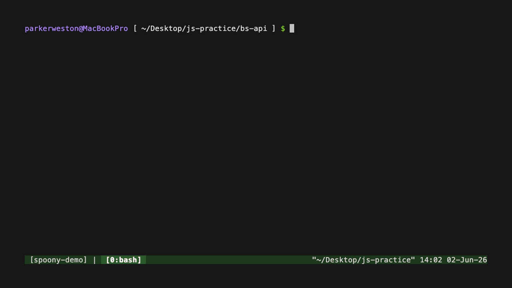
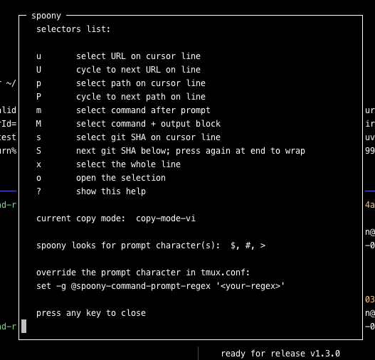

# tmux-spoony



Small tmux copy-mode helpers for grabbing useful terminal text without replacing tmux copy mode.

Spoony adds one-key selectors for URLs, paths, shell commands, git SHAs, and whole lines. You still navigate with normal tmux copy-mode keys.

## Requirements

- tmux 3.5+
- Either copy mode, vi or default (emacs)
- Bash 3.2+
- A URL/file opener if you use Spoony's default `o` opener: macOS `open` or Linux `xdg-open` (provided by `xdg-utils` on most distros). [tmux-open](https://github.com/tmux-plugins/tmux-open) is the recommended companion.


## Usage

Enter copy mode:

```text
prefix [
```

Move to a target line with normal tmux copy-mode navigation, then press:

```text
u  select URL on the cursor line
U  cycle to the next URL on the cursor line
p  select path on the cursor line
P  cycle to the next path on the cursor line
m  select command after the prompt
M  after pressing the lowercase variant to select command output block until the next prompt
s  select the git SHA on the cursor line
S  jump to the next git SHA below the cursor; press again at the end to wrap
x  select the whole line
o  open the selected text
y  yank the selected text
?  show the spoony cheatsheet in a popup
```

`y` is tmux's own copy-mode-vi binding (yank/copy), not a Spoony key, so it works with or without Spoony.

The `?` popup is generated from your _actual_ resolved keys, so it always reflects any remaps, disabled keys, or derived cycle keys. It also shows the active copy-mode table (`copy-mode-vi` or `copy-mode`). Press any key to close it.

The command block selector (`m/M`) starts at the command after the prompt, then keeps selecting downward until it finds the next prompt. If the command is still running and there is no next prompt, it selects through the last non-empty output row. That means interrupted commands include the `^C` line because it is part of how the command block ended.

Examples:

**Selecting a URL**

```text
running on http://localhost:3000/practice
```

Move to that line, press `u` to select the URL, then press `o` to open it.

---

**Cycling between URLs on a line**

```text
docs available at http://localhost:3000/docs and http://localhost:3000/api
```

Move to that line, press `u` to select the nearest URL, then press `U` to cycle to the next URL on that same line.

---

**Cycling between paths on a line**

```text
saved assets/tmuxSpoony.gif and logs/server-output.txt
```

Move to that line, press `p` to select the nearest path, then press `P` to cycle to the next path on that same line.

---

**Selecting a command and its output**

```text
dev@host [ ~/project/api ] $ npm run start
> start
> node server.js

running on http://localhost:3000/practice
^C
dev@host [ ~/project/api ] $
```

Move to the command line, press `m` to select only `npm run start`, then press `M` to select the command and its output through `^C`, stopping before the next prompt.

> Works best if you press `m` (lowercase) before `M` (uppercase).

## Stepping through SHAs

Press `s` to select the SHA on the cursor line. Press `S` (or hold it down) to jump to the next SHA below and keep stepping through them. When you reach the last one, press `S` again to wrap back to the first SHA shown after the shell prompt that output the SHA's. Both SHA-1 and SHA-256 object IDs are supported.

## Install

### TPM

Add Spoony to your `~/.tmux.conf` plugin list:

```tmux
set -g @plugin 'parwest/tmux-spoony'
```

Ensure your TPM section looks roughly like this:

```tmux
# Plugins
set -g @plugin 'tmux-plugins/tpm'
set -g @plugin 'parwest/tmux-spoony'

# Keep this at the bottom of the TPM section
run '~/.tmux/plugins/tpm/tpm'
```

Reload tmux config:

```sh
tmux source-file ~/.tmux.conf
```

Install the plugin with TPM:

```text
prefix + I
```

### Local Checkout

For local testing without TPM, run the plugin file directly:

```sh
tmux run-shell '/path/to/tmux-spoony/tmux-spoony.tmux'
```

To load a local checkout from `~/.tmux.conf`:

```tmux
run-shell '/path/to/tmux-spoony/tmux-spoony.tmux'
```

## Key Bindings

Spoony works without configuration. To customize the copy-mode keys, add options to your `~/.tmux.conf` before Spoony is loaded. If you use TPM, put them after `set -g @plugin 'parwest/tmux-spoony'` and before `run '~/.tmux/plugins/tpm/tpm'`. If you use a local checkout, put them before the Spoony `run-shell` line.

```tmux
set -g @spoony-url-key 'u'
set -g @spoony-url-cycle-key 'U'
set -g @spoony-path-key 'p'
set -g @spoony-path-cycle-key 'P'
set -g @spoony-command-key 'm'
set -g @spoony-command-block-key 'M'
set -g @spoony-sha-key 's'
set -g @spoony-sha-next-key 'S'
set -g @spoony-line-key 'x'
set -g @spoony-open-key 'o'
set -g @spoony-help-key '?'
```

### Copy-mode key conflicts

Spoony binds both copy-mode tables, so the clashes depend on which one is active for you (the `?` popup shows the active table). Most Spoony defaults land on keys tmux leaves unbound; the few that reuse a built-in differ by table.

**`copy-mode-vi`** (`set -g mode-keys vi`) — four clashes:

| Spoony default    | Replaces built-in | Option to remap or disable  |
| ----------------- | ----------------- | --------------------------- |
| `?` help          | `search-backward` | `@spoony-help-key`          |
| `o` open          | `other-end`       | `@spoony-open-key`          |
| `P` path cycle    | `toggle-position` | `@spoony-path-cycle-key`    |
| `M` command block | `middle-line`     | `@spoony-command-block-key` |

**`copy-mode`** (`set -g mode-keys emacs`) — one clash, since emacs copy-mode navigates with `C-`/`M-` chords and leaves the bare letters unbound:

| Spoony default | Replaces built-in | Option to remap or disable |
| -------------- | ----------------- | -------------------------- |
| `P` path cycle | `toggle-position` | `@spoony-path-cycle-key`   |

If you rely on any of these built-ins, point the matching option at another key (for example `set -g @spoony-help-key 'F1'`) or disable Spoony's binding with `off` (for example `set -g @spoony-open-key 'off'`). Every other default leaves the built-in copy-mode keys untouched.

If `@spoony-url-cycle-key`, `@spoony-path-cycle-key`, `@spoony-command-block-key`, or `@spoony-sha-next-key` is unset and the base selector key is a single lowercase letter, Spoony derives the related key by uppercasing it. For example, `u` derives `U`, `p` derives `P`, `m` derives `M`, and `s` derives `S`.

For example, this moves the default URL and path selectors to uppercase keys and moves their cycle keys to control keys:

```tmux
set -g @spoony-url-key 'U'
set -g @spoony-url-cycle-key 'C-u'
set -g @spoony-path-key 'P'
set -g @spoony-path-cycle-key 'C-p'
set -g @spoony-command-key 'M'
set -g @spoony-command-block-key 'B'
set -g @spoony-line-key 'X'
```

Any key can be disabled with `off`:

```tmux
set -g @spoony-open-key 'off'
set -g @spoony-url-cycle-key 'off'
```

Turning off a base selector key also turns off its derived uppercase variant. For example, this disables both `u` and `U`:

```tmux
set -g @spoony-url-key 'off'
```

To keep cycling while the base key is off, set the cycle key explicitly:

```tmux
set -g @spoony-url-key 'off'
set -g @spoony-url-cycle-key 'U'
```

When a key is `off`, Spoony leaves existing tmux and custom bindings alone. If Spoony already owns that default key, reloading your config restores tmux's built-in binding, or leaves the key unbound when tmux has no default there. If you previously used a custom Spoony key, unbind that old key manually or restart tmux.

If you move a base selector to an uppercase key that matches the default cycle key (for example `set -g @spoony-url-key 'U'`), the cycle key is disabled instead of overwriting your base binding. Set `@spoony-url-cycle-key` explicitly if you still want cycling.

## Prompt Matching

The command selector uses this default prompt regex:

```tmux
set -g @spoony-command-prompt-regex '((^|[[:space:]])[$#]|[[:space:]]>) +'
```

It matches common prompts ending in `$ `, `# `, or `> `. The `>` only counts when it follows whitespace, so lines like git's `HEAD -> ...` decoration and npm's `> start` output are not mistaken for a shell prompt. (A bare `> ` prompt at the very start of a line is indistinguishable from such output and is treated as output.) If your shell produces prompt-like output on the same line, set a more specific regex before loading Spoony.

### Custom prompt examples

Spoony recognizes prompts ending in `$`, `#`, or `>` by default. You do not need to configure this option unless your prompt uses another symbol or requires more specific matching.

Use only one setting matching the symbol at the end of your prompt:

| Prompt example       | Common shell or theme | Setting                                            |
| -------------------- | --------------------- | -------------------------------------------------- |
| `user@host ~/repo $` | Bash and sh           | `set -g @spoony-command-prompt-regex '^[^$]*\$ +'` |
| `user@host ~/repo %` | Zsh                   | `set -g @spoony-command-prompt-regex '^[^%]*% +'`  |
| `user@host ~/repo >` | Fish                  | `set -g @spoony-command-prompt-regex '^[^>]*> +'`  |
| `~/repo ❯`           | Starship and Pure     | `set -g @spoony-command-prompt-regex '^[^❯]*❯ +'`  |
| `~/repo ➜`           | Oh My Zsh themes      | `set -g @spoony-command-prompt-regex '^[^➜]*➜ +'`  |

#### Manual installation

Place the option immediately before the `run-shell` line that loads Spoony:

```tmux
set -g @spoony-command-prompt-regex '^[^❯]*❯ +'

run-shell '/path/to/tmux-spoony/tmux-spoony.tmux'
```

#### TPM installation

Place the option after Spoony's plugin declaration and before the line that runs TPM:

```tmux
set -g @plugin 'tmux-plugins/tpm'
set -g @plugin 'parwest/tmux-spoony'

set -g @spoony-command-prompt-regex '^[^❯]*❯ +'

# Keep this at the bottom of the TPM section
run '~/.tmux/plugins/tpm/tpm'
```

After changing the option, reload your configuration:

```sh
tmux source-file ~/.tmux.conf
```

## The help menu

Press `?` in copy mode to open the Spoony cheatsheet in a popup. It is generated from your _actual_ resolved keys, so it always reflects any remaps, disabled keys, or derived cycle keys. Press any key to close it.



The popup has four sections:

- **selectors list** — every active Spoony key and what it selects. Lowercase keys (`u`, `p`, `m`, `s`) select the nearest match on the cursor line; the uppercase variants (`U`, `P`, `M`, `S`) cycle or extend from there. `o` opens the current selection, and `?` reopens this help.
- **current copy mode** — the active copy-mode table (`copy-mode-vi` or `copy-mode`) that Spoony bound its keys into, so you know which keymap is in effect.
- **spoony looks for prompt character(s)** — the prompt character(s) Spoony uses to find where commands begin when selecting command/output blocks (`m`/`M`).
- **override the prompt character** — the `@spoony-command-prompt-regex` setting to put in `tmux.conf` if your shell prompt differs from the default. See [Prompt Matching](#prompt-matching) for details.
